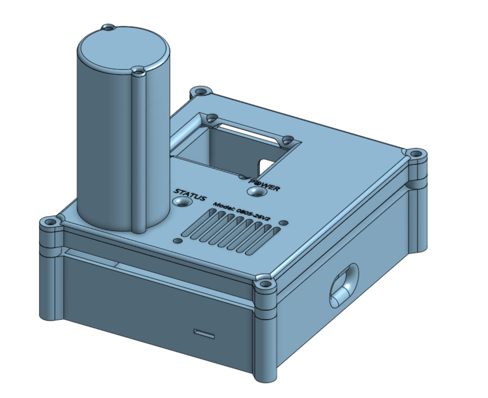
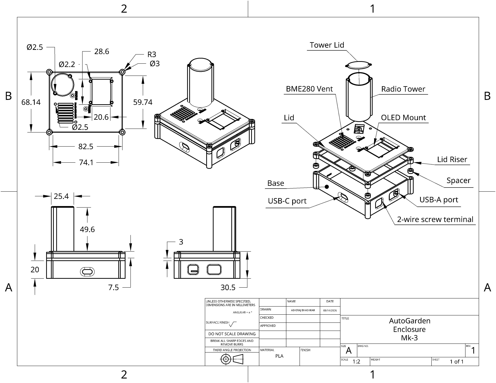

# AutoGarden V2

**Custom ESP32-S3 environmental monitoring and automated plant-watering system**

AutoGarden is an embedded system designed to monitor a plant's environment and soil conditions and automatically provide water when the soil becomes too dry.

The project combines a **custom ESP32-S3 PCB, environmental and soil sensors, OLED interface, MOSFET-controlled water pump, and custom 3D-printed enclosure** into a standalone monitoring and watering device.

> **Project Status:** Functional prototype / active development

[ADD YOUR BEST PHOTO OF THE FINISHED AUTOGARDEN HERE]

---

## Project Overview

AutoGarden began as a prototype built around an ESP32 development board and external sensor modules. The second revision moves the system onto a custom PCB and integrates the major electronics into a more compact and purpose-built platform.

The current system can:

* Measure soil moisture
* Measure temperature, humidity, and atmospheric pressure
* Display environmental information on an OLED
* Determine when soil moisture falls below a watering threshold
* Control a small water pump through a MOSFET
* Provide visual system status through onboard LEDs
* Support future long-range wireless communication and portable power

The enclosure was also designed specifically for the electronics, including sensor ventilation, an OLED window, status indicators, mounting hardware, and provisions for future weather protection.

---

## Features

### Environmental Monitoring

A BME280 sensor provides:

* Temperature
* Relative humidity
* Atmospheric pressure

The sensor communicates with the ESP32-S3 over I2C.

### Soil Moisture Monitoring

A capacitive soil-moisture sensor is read through an ESP32 ADC input.

Raw ADC measurements are converted into an estimated **0–100% soil moisture value** using calibrated wet and dry reference values.

Current calibration:

* Dry: approximately 3000 ADC
* Wet: approximately 1300 ADC

### Automatic Watering

The PCB includes an AO3400A MOSFET-based pump driver controlled by the ESP32-S3.

When soil moisture falls below the configured threshold, the firmware can activate an external water pump for a controlled watering interval.

The current prototype uses a configurable watering threshold and watering/soaking timing to prevent the pump from simply running continuously while waiting for the soil sensor to respond.

### OLED User Interface

A small OLED provides local environmental information and system status.

The interface displays measurements including:

* Temperature
* Humidity
* Pressure
* Soil moisture

During automatic watering, the display can indicate states such as:

**Watering...**

and

**Soaking...**

### Status Indicators

The PCB includes dedicated power and programmable status LEDs.

The status LED is also used during hardware testing to provide visual feedback about sensor initialization and system operation.

---

## Custom PCB

[ADD PCB RENDER / PHOTO HERE]

AutoGarden V2 replaces the development-board-based architecture of the original prototype with a custom PCB.

The board was designed around an **ESP32-S3-WROOM module** and incorporates the major interfaces required by the system.

### PCB Interfaces

| Subsystem                  | Interface              |
| -------------------------- | ---------------------- |
| BME280                     | I2C                    |
| OLED                       | I2C                    |
| Soil moisture sensor       | ADC                    |
| Water pump                 | GPIO-controlled MOSFET |
| Status LED                 | GPIO                   |
| Long-range radio expansion | UART                   |
| Programming / power        | USB                    |

The pump driver uses an **AO3400A N-channel MOSFET**, gate resistor, gate pulldown, and flyback protection for controlling an external DC pump.

[ADD SCHEMATIC SCREENSHOT HERE]

---

## Firmware

Firmware is written in **C++ using the Arduino framework for ESP32**.

The firmware handles:

1. Hardware initialization
2. I2C device initialization
3. BME280 measurements
4. Soil-moisture ADC sampling
5. Soil-moisture percentage conversion
6. OLED updates
7. Status LED behavior
8. Soil-moisture threshold detection
9. Automatic pump control

The firmware is being developed alongside hardware testing so individual subsystems can be validated before full integration.

---

## Hardware Bring-Up

One of the major goals of AutoGarden V2 was learning the complete bring-up process for a custom embedded PCB.

Subsystems were tested individually before integration.

### Verified

* [x] ESP32-S3 boot
* [x] USB programming
* [x] Power system
* [x] Programmable status LED
* [x] I2C communication
* [x] BME280 detection
* [x] Temperature measurement
* [x] Humidity measurement
* [x] Pressure measurement
* [x] OLED communication
* [x] Capacitive soil-moisture measurement
* [x] Automatic pump watering — final integration testing

### Planned / Future Development

* [ ] Long-range radio communication
* [ ] Battery operation
* [ ] Solar charging/power
* [ ] Outdoor weather protection
* [ ] Remote monitoring
* [ ] Additional sensor nodes

---

## Mechanical Design



A custom enclosure was designed alongside the PCB and manufactured using FDM 3D printing.

The enclosure includes:

* PCB mounting points
* OLED viewing window
* Dedicated ventilation above the BME280
* Power and status LED openings
* Embedded labels
* Screw-mounted lid
* TPU gasket
* External sensor-wire routing
* Mounting provisions for a future weather shield

Several enclosure revisions were produced to improve component clearance, assembly, sensor airflow, and serviceability.



---

## Design Challenges & Lessons Learned

### Sensor Ventilation

Early enclosure testing produced unusually high humidity readings. The original BME280 ventilation opening provided limited air exchange.

A revised lid was designed with a substantially larger vent directly above the sensor while retaining mounting points for a future external weather shield.

### Mechanical Tolerances

Several enclosure revisions were required to account for:

* PCB/component clearances
* OLED positioning
* USB connector clearance
* Screw-head clearance
* FDM dimensional tolerances
* Wire routing

These iterations reinforced the importance of designing mechanical components around real manufactured hardware rather than relying exclusively on nominal CAD dimensions.

### Hardware Bring-Up

Initial firmware was intentionally kept simple. Individual systems such as the status LED and I2C bus were tested independently before integrating the complete firmware.

This made it possible to distinguish hardware, firmware, and mechanical problems during debugging.

---

## System Architecture

```text
                    +----------------+
                    |    ESP32-S3    |
                    +-------+--------+
                            |
          +-----------------+------------------+
          |                 |                  |
         I2C               ADC               GPIO
          |                 |                  |
    +-----+-----+      +----+-----+      +-----+------+
    |           |      |          |      |            |
 BME280       OLED   Soil Sensor  |   Status LED   MOSFET
                                                      |
                                                   DC Pump
```

Future versions will add long-range radio communication and portable power.

---

## Tools & Technologies

**Hardware**

* ESP32-S3
* BME280
* Capacitive soil-moisture sensor
* SSD1306 OLED
* AO3400A MOSFET
* DC water pump

**Software**

* Arduino / C++
* I2C
* ADC
* UART

**Design & Fabrication**

* PCB schematic and layout
* EasyEDA
* Onshape
* FDM 3D printing
* PLA
* TPU

---

## Project Evolution

### V1 — Proof of Concept

The first AutoGarden prototype used an ESP32 development board and modular sensor connections to validate the basic concept and firmware.

### V2 — Custom Hardware

V2 introduced:

* Custom ESP32-S3 PCB
* Integrated environmental sensor
* Pump-control circuitry
* OLED interface
* Improved enclosure
* TPU sealing components
* Expansion interfaces for future wireless communication

The current focus is completing automatic watering integration and documenting the finished prototype.

---

## Future Work

The long-term goal is to develop AutoGarden into a distributed, off-grid plant-monitoring platform.

Potential future improvements include:

* Long-range wireless sensor nodes
* Solar-powered operation
* Battery management
* Weather-resistant enclosure
* Remote environmental data collection
* Multiple plant-monitoring nodes
* Configurable watering thresholds
* Improved soil-moisture calibration

---

## Repository Structure

```text
AutoGarden/
├── README.md
├── firmware/
│   └── AutoGarden_V2.ino
├── hardware/
│   ├── schematic/
│   ├── pcb/
│   └── bom/
├── mechanical/
│   ├── enclosure/
│   └── gasket/
├── images/
└── docs/
```

---

## Author

Electrical engineering student project focused on **embedded systems, PCB design, sensor integration, firmware development, and electromechanical system design**.
